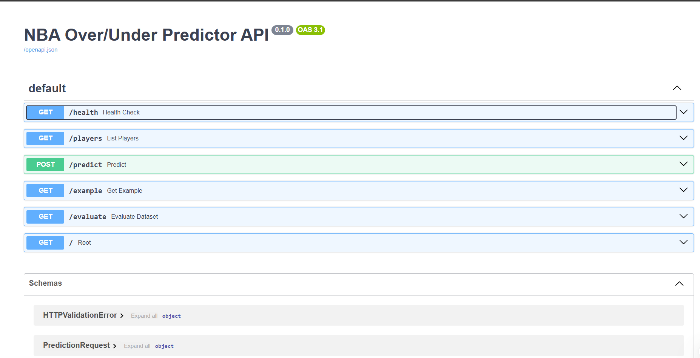
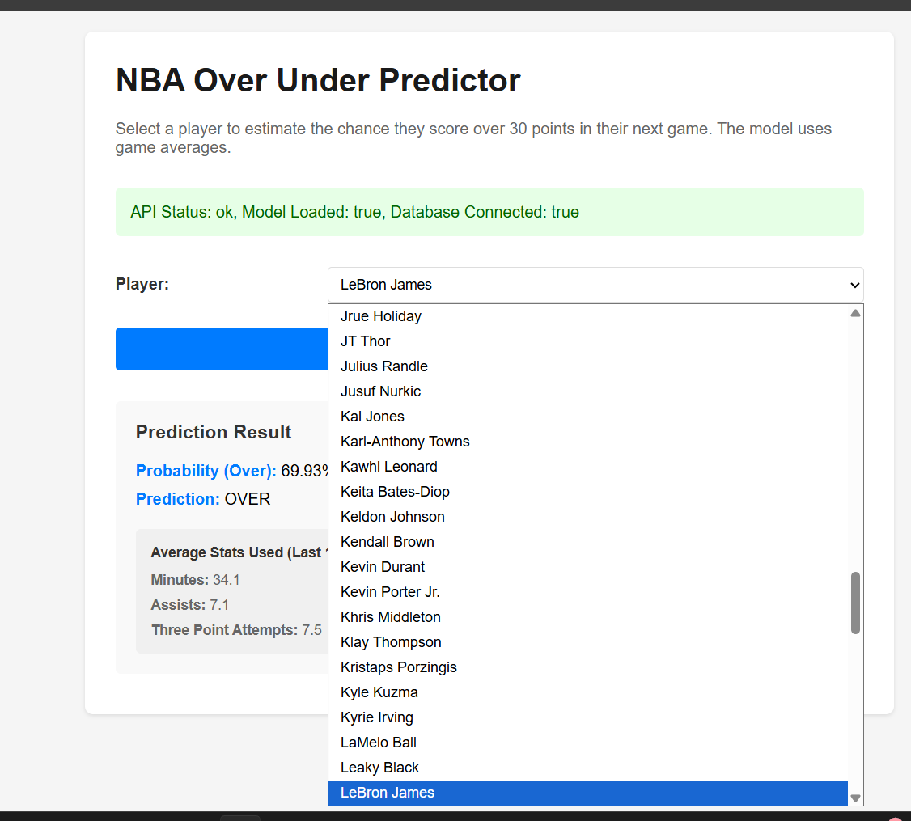
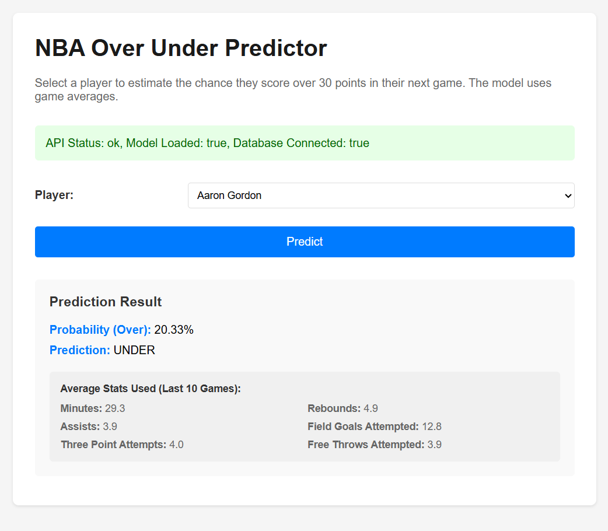

NBA Over/Under Predictor 

1) Executive Summary
Problem

Sports bettors, fantasy basketball players, and fans often want to estimate whether a player will score over or under a target point line in their next game. Manually analyzing recent performance is time-consuming and error-prone.

Solution

This project provides a deployed web application that predicts the probability a player scores over 30 points in their next game. The system uses recent game averages, a trained PyTorch model, and a clean, interactive FastAPI web interface. Users select a player, click Predict, and immediately see both the prediction and the supporting game statistics, making the model’s reasoning transparent.

2) System Overview
Course Concepts Used

FastAPI Web Services (Module: Web Services)

SQLite Database Integration (Module: Databases)

Docker Containerization (Module: DevOps & Containers)

PyTorch Modeling (Module: Machine Learning)

Cloud Deployment via Azure App Service (Module: Cloud Deployment)

Architecture Diagram
┌──────────────────────┐          HTTP Requests         ┌──────────────────────────┐
│                      │ ─────────────────────────────▶ │                          │
│   User Web Browser   │                                │      FastAPI Backend     │
│  (index.html + JS)   │ ◀───────────────────────────── │   (API + UI Rendering)   │
└──────────────────────┘          JSON Responses         └──────────┬──────────────┘
                                                                      │
                                                                      │
                                                                      ▼
                                                          ┌──────────────────────────┐
                                                          │   PyTorch Model (.pt)    │
                                                          │  Predicts Over/Under 30  │
                                                          └──────────────────────────┘
                                                                      │
                                                                      ▼
                                                          ┌──────────────────────────┐
                                                          │      SQLite Database     │
                                                          │  (Historical Game Logs)  │
                                                          └──────────────────────────┘                                                       

Then, it is wrapped and deployed in Docker and Azure   

Data, Models & Services

Data Source: Synthetic + curated NBA game log dataset

Size: ~1000 game rows, ~140 players

Format: CSV → Loaded into SQLite DB (data/db.nba.sqlite)

Model: PyTorch binary classifier (predict Over 30 points)

Services: FastAPI backend, HTML/JS frontend, JSON API routes

License: Educational use only (synthetic and curated data)

3) How to Run (Local)
Using Docker (recommended)
# build the image
docker build -t nba-predictor:latest .

# run container
docker run --rm -p 8090:8090 --env-file .env nba-predictor:latest

# health check
curl http://localhost:8090/health

Without Docker (developer mode)
uvicorn src.api.main:app --host 0.0.0.0 --port 8090

4) Design Decisions
Why this approach?

FastAPI → simple routing, built-in docs, easy JSON APIs

PyTorch → flexible training and clean model export

SQLite → lightweight database ideal for containerization

Docker → guarantees “it works everywhere”

Azure App Service → one-click deployment for containerized apps

Alternatives Considered

Flask (simpler but less structured than FastAPI)

PostgreSQL (more powerful, unnecessary for small datasets)

Real-time NBA API Scraping (out of scope + rate limits + API keys)

Tradeoffs

Performance: Lightweight model; inference is instantaneous

Cost: Azure App Service free tier sufficient

Complexity: Building DB + model pipeline adds initial work

Maintainability: Synthetic dataset → predictable but not real-time

Security & Privacy

No PII collected

No user accounts

No secrets in code (environment variables used via .env)

Input validation handled by Pydantic

Ops Considerations

Health endpoint: /health

Evaluation endpoint: /evaluate (metrics + dataset stats)

Logs: Handled by Uvicorn and Azure App Service

Limitations:

Model trained on static dataset

Does not pull live NBA performance data

Predicts only “Over 30 Points”

5) Results & Evaluation
Model Performance

Validation

Model tested on a separate evaluation set

FastAPI tested via /docs + manual UI testing

Database integrity verified at app startup

6) What’s Next
Planned Improvements

Add live NBA API integration

Predict additional stats (rebounds, assists, fantasy score)

Multi-threshold predictions (Over 20, 25, 30, 35…)

Add visual charts of historical player performance

Add CI/CD pipeline for Azure deployments